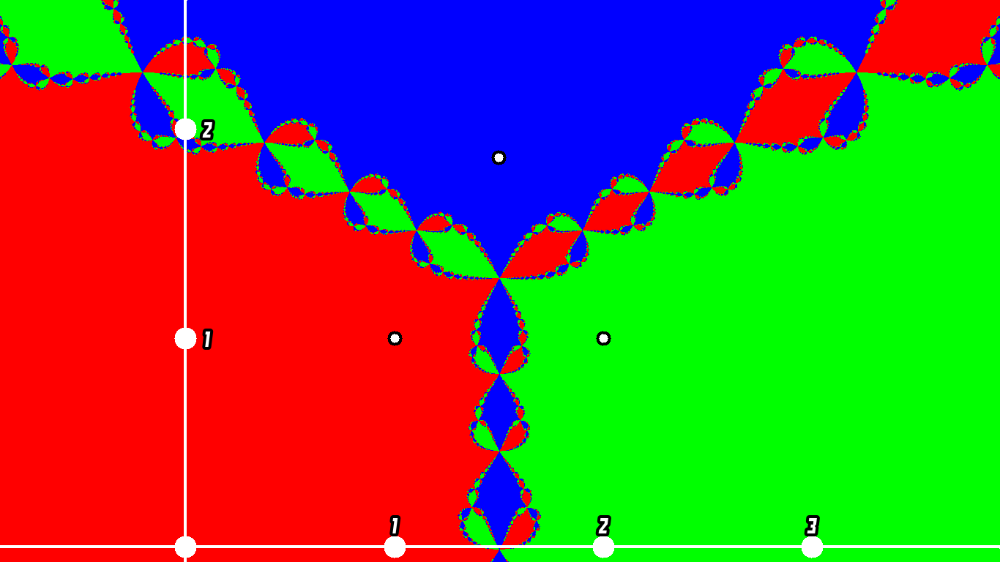

<h1>Newton Fractal</h1>
This is a program that renders newton fractals

<h4>Installation:</h4>
run make to compile 
to run: 
./newtonfractal 

<h4>Controls:</h4>
R to reset coordinate system to origin 
N to increase fractal depth 
P to decrease fractal depth 
K to increase resolution 
J to decrease resolution 
Mouse1 to move coordinate system 
Mouse1 on a point to move point 
Mouse2 to display coordinates of mouse pointer 
Scroll Wheel to zoom 

<h4>Dependencies:</h4>
sdl
 
 
 

